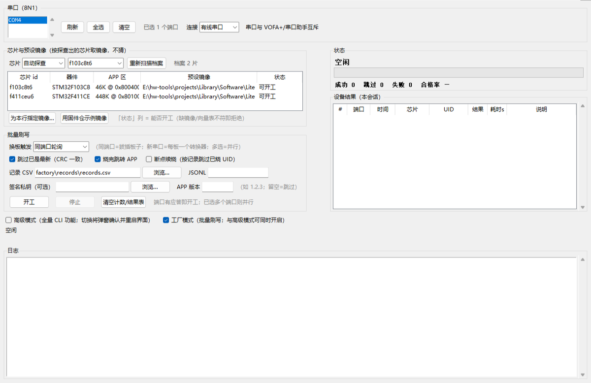
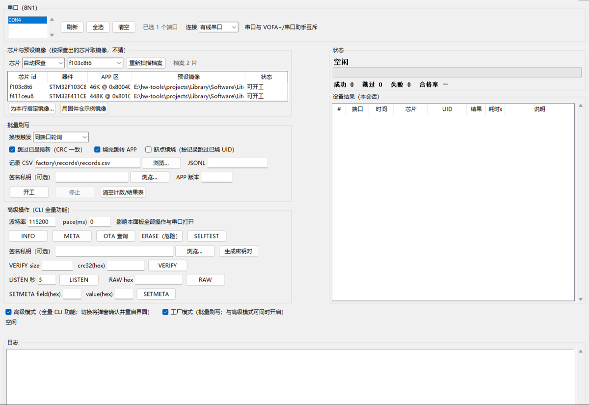

# LiteBootUpgrader — Host Tool for LiteBootLoader

[简体中文](README.md) | English

The official host tool for
[LiteBootLoader](https://github.com/Liu-bit264/LiteBootLoader) (the firmware repo,
sibling directory `../LiteBootLoader` locally): one-click upgrade over serial (wired)
or Bluetooth (HC-05 SPP), OTA status query, jump to APP, reset, workflow self-test and
a GUI.

Two entry points plus four helper modules: `bl_upgrade.py` is both the CLI and the
protocol library (the **sole implementation** of the upgrade flow; frame format, command
table and state machine are specified in the firmware repo's `docs/protocol.md`), and
`bl_upgrade_gui.py` is the tkinter GUI (basic / advanced / **factory batch** shapes, the
latter two can be enabled together); `bl_chip.py` holds the chip profiles and host-side
chip detection (consuming the firmware repo's `chips/<id>.json`), and `bl_factory.py` is
the batch flashing engine shared by the GUI factory panel and the CLI `factory`
subcommand; `bl_powerloss_drill.py` is the power-loss acceptance drill and
`test_host_protocol.py` the hardware-free host-side test suite. Pure Python, with pyserial
as the only runtime dependency (tkinter additionally for the GUI).

## Quick Start

### Option A: Prebuilt executables (no Python needed)

Double-click `dist\bl_upgrade_gui.exe` (build instructions below), or use
`dist\bl_upgrade.exe` on the command line. Single-file, no installation; distribution
is just copying the exe.

The bundled chip profile pack (`bl_chip_profiles.json`) is packaged inside the exe, so the
**target machine needs no firmware repo** — factory mode's automatic detection still works;
drop a newer pack next to the exe to override the bundled one. The factory config
(`factory/local.json`), result records and preset images all resolve against the **exe's own
directory** (not the launch CWD), so a double-clicked exe writes next to itself.

### Option B: Run from source (dependency isolation recommended)

> **Dependency isolation (recommended)**: install Python dependencies in an isolated
> environment (`uv run --with` or a venv) instead of polluting the global interpreter;
> wheels stay in the package manager cache. The examples below use `uv`; any Python
> with pyserial installed works too.

```bash
# GUI (or double-click bl_upgrade_gui.bat)
uv run --python 3.12 --with pyserial bl_upgrade_gui.py

# CLI
uv run --python 3.12 --with pyserial bl_upgrade.py upgrade <image.bin> --port COM4
uv run --python 3.12 --with pyserial bl_upgrade.py selftest --port COM4
```

## GUI Usage

**Basic mode** (default):


**Advanced mode** — tick the "advanced mode" checkbox at the bottom → confirm in the
dialog → the UI restarts with the full feature set; unticking likewise confirms and
restarts back. The mode is stored in `~/.litebootupgrader_gui.json`:


**Factory mode** — tick the "factory mode" checkbox at the bottom → confirm in the dialog
→ the UI restarts with the batch flashing panel: it takes the preset image for the
detected chip, flashes units back to back and records every result for traceability (see
"Factory Mode (batch flashing)" below):



The two mode switches are **independent and can be enabled together** (ticking one never
drags the other in; you can still enter advanced mode while factory mode is on, and vice
versa). With both on, all four panels are present, laid out as a **left panel area plus a
right sidebar**: the sidebar keeps the status and the device result table visible at all
times (the two things you watch during a batch — they never scroll away), the left panel
area scrolls with the mouse wheel when it does not fit, and the log pane and status line
stay pinned at the bottom:



- **One-click upgrade**: works from any state (BL or APP) — when the target runs the
  APP, it automatically takes the "request back to BL" path (SET_META bl_request →
  reset → BL consumes the flag), with a progress bar and log throughout;
- **Connection type**: a dropdown in the serial frame selects "wired serial / Bluetooth
  HC-05" — Bluetooth is simply the SPP COM port created by pairing (the module needs a
  one-time AT setup to 115200, see the firmware repo's `docs/dev/bluetooth_notes.md`
  §5); open failures retry automatically; the protocol stack is fully shared with wired;
- **Jump / Reset / PING**: single-command actions, serial banner read back into the log pane;
- **Image pane**: shows the size and CRC32 after 4-byte padding (same scale as VERIFY);
- **Advanced panel (advanced mode only)**: INFO / META / OTA query / ERASE (double
  confirmation) / SELFTEST / VERIFY / LISTEN / RAW / SETMETA, plus baud-rate and
  pace(ms) options — behavior aligned one-to-one with the CLI;
- **Factory panel (factory mode only)**: chip & preset-image table and batch options on the
  left; a **right sidebar** pins the status block (headline state / progress bar /
  OK·SKIP·FAIL·pass rate / per-port state) and the device result table (# / port / time /
  chip / UID / result / elapsed / note — image and SHA-256 live in the record file and the
  log); ports are **multi-select** (N ports = N parallel sessions); start/stop share the
  `busy` mutex so factory and advanced operations never fight over the serial port;
- **Window and scrolling**: the window is sized to the screen (no hardcoded height), the
  left panel area scrolls with the wheel when it does not fit (a horizontal scrollbar
  appears if needed), and the status line and log stay pinned at the bottom — on small
  screens or with both modes on, no control is lost;
- **Serial exclusivity**: close VOFA+ / other serial monitors first (a COM port is exclusive).

> Factory/advanced isolation means **separated capabilities, one shared resource**: the
> factory side reads none of the advanced panel's variables (baud rate, pace and signing
> key all come from the factory panel — so a key left over in advanced mode can never be
> silently picked up by a batch run), and the advanced side never touches the factory
> presets, trigger mode, counters or record file. The unit tests assert each of these.

## CLI Subcommands

| Subcommand | Purpose |
|---|---|
| `upgrade <bin>` | One-click upgrade (ensure_bl → erase → chunked write → verify; `--key <pem>` enables signed verification) |
| `keygen` | Generate a P-256 test keypair (private-key PEM + public-key local header; no key material ever enters git) |
| `chips list \| sync \| detect` | Chip profiles: list (with origins) / rebuild the bundled profile pack from the firmware repo / detect the chip on a connected board |
| `factory` | Factory batch flashing (unattended; same engine as the GUI factory panel — see `--help`) |
| `ota` | OTA status query (BL/APP versions, APP validity, arrival channel, Bluetooth link) |
| `selftest` | 15-step hardware-in-the-loop upgrade self-test (`--chip` takes the APP partition size from the profile) |
| `ping / info / meta` | Handshake / BL info & telemetry / parameter-area metadata |
| `erase / verify <size> <crc32_hex>` | Manual step-by-step operations |
| `jump / reset` | Jump to APP / reset |
| `setmeta <f> <v> / raw <hex> / listen <sec>` | Metadata / raw bytes / monitor |

Common options: `--port` (default COM4, set to your actual port; the Bluetooth SPP port
works the same way), `--baud 115200`, `--pace <ms>` (inter-command delay, for timing
experiments), `--conn serial|bt` (connection type; bt = Bluetooth SPP with automatic
open retry), `--chip <id|auto>` (drives the APP partition size and image health check from
the chip profile; `auto` = get into BL first, then probe via GET_INFO),
`--profiles <file>` / `--firmware-root <dir>` (profile sources), `--no-probe` /
`--force-image` (manual fallbacks for probing and the image health check).
Run `bl_upgrade.py -h` (`--help`) to list all subcommands and options; `--version` prints
the version.

### Signed verification (1.4.0+, pairs with firmware BL 0.4.0 / ADR-020)

```bash
# 1) generate a test keypair (keep the PEM local; header goes into the firmware
#    repo's chip port dir and must be gitignored)
uv run --python 3.12 --with pyserial --with cryptography bl_upgrade.py keygen \
    --out-key sign_test_key.pem \
    --out-header ../LiteBootLoader/port/stm32f4/f411ceu6/bl_sign_pubkey_local.h
# 2) rebuild the firmware with BL_SIGN_EN=1 (the enable warning in the build log is expected)
# 3) signed upgrade: sends 0x11 VERIFY_SIGNED after the chunks; auth must be set to jump
uv run --python 3.12 --with pyserial --with cryptography bl_upgrade.py \
    upgrade app.bin --port COM4 --key sign_test_key.pem
```

Flipping any byte of the image makes the firmware answer `SIGN_ERROR` without persisting
(no jump); images upgraded via legacy VERIFY carry auth=0 and cannot jump on
sign-enabled firmware either. Physical/debug-port attacks and rollback are out of scope
(ADR-020 threat model).

> Validation status: host-side unit tests pass (keygen artifact format, signature →
> public-key verification, tamper invalidation, 0x11 frame layout LEN=72); **no on-target
> HIL run yet** — the firmware-side pending item is tracked in its
> `docs/dev/test_plan.md` §5.1.

## Factory Mode (batch flashing, since 1.5.0)

Production-line batch flashing: **plug a board in and it flashes, the preset image is
picked by the detected chip, every result is recorded for traceability**. The GUI
(tick "factory mode") and the CLI (`factory` subcommand) are two front ends over one engine.

### Parallel ports (many serial adapters on one machine)

In factory mode the port box is a **multi-select list**: one port selected = a single
batch; N selected = N **independent sessions flashing in parallel** (multi-rig /
multi-adapter setups). The ports never affect each other — a port that will not open only
drops that port (reason logged, the rest keep going); only configuration-level problems
(e.g. a detected chip with no preset image) halt the whole batch. Points to know:

- **Stop** is broadcast to every port (soft stop = each port finishes its current unit;
  press again = immediate stop);
- the **unit cap** is counted across the **session** (not once per port); reaching it
  broadcasts a soft stop, so the units already in flight finish — at most
  "ports − 1" units over the cap;
- the **record file** is written by all threads (internally locked): one header only,
  rows distinguished by port;
- the **status column** shows each port's state, with the aggregate headline above it;
- if no port opens at all, that is reported as an environment error (CLI exits non-zero)
  rather than "batch finished, 0 units";
- CLI equivalent: `--ports COM4,COM5` (omit it to use the single `--port`).

### Configuration: profiles, preset images, records

- **Chip profiles** are merged in order (first wins, later sources fill gaps; `chips list`
  prints each profile's origin): an explicit `--profiles` file → the `chips` overrides in
  `factory/local.json` → the sibling repo's `../LiteBootLoader/chips/*.json` (live source
  of truth on a dev machine) → the bundled `bl_chip_profiles.json` (a committed generated
  file, rebuilt from the firmware repo by `chips sync`, so a single-file exe works without
  the firmware repo present).
- **Preset images and the record path** live in `factory/local.json`
  (`factory/local.example.json` is a documented example — copy and rename; that file is
  never committed). The GUI can edit them directly (double-click a preset row to pick an
  image, browse for the record path; settings are saved on start).
- **A chip with no preset image halts the batch with a message** — factory mode takes the
  image by chip and never guesses.

### Chip detection

The BL protocol has no chip-id field: `GET_INFO` returns the flash size and a 96-bit UID
(the UID is a **per-die serial**, not a model), so detection matches the **flash-size
fingerprint** (F103C8T6 = 64 KiB, F411CEU6 = 512 KiB).

When several profiles share a flash size, a **read-only** `VERIFY` boundary probe
disambiguates: the firmware first checks `size > BL_APP_SIZE` and answers `RANGE_ERROR`,
only then computes a CRC — so "candidate APP size + a garbage CRC" in one round trip tells
whether that candidate fits, without writing flash (cost: a 2⁻³² chance the garbage CRC
matches, which persists metadata once; that device is fully reflashed right after, so it
is harmless in practice). Use `--no-probe` to skip probing and report the ambiguity instead.

An unknown capacity, or a target that will not enter BL, fails that unit and stops —
**nothing is flashed blindly**. Known limit: two chips with identical capacity *and*
partition cannot be told apart by the protocol alone; specify `--chip <id>` by hand (a
firmware-side chip-id field, or reading `DBGMCU_IDCODE` over the debug port, would be the
thorough fix — out of scope here).

### Image health check (wrong-image guard)

Before flashing, each chip's preset image is checked: size ≤ that chip's APP partition,
4-byte padding, and a **vector-table check** (first word = initial MSP inside that chip's
SRAM, second word = reset handler with the Thumb bit inside that chip's APP region). This
catches two real accidents: flashing **another chip's** image, and stuffing a
**BootLoader image** into the APP region. A failing image is not flashed; `--force-image`
overrides in an emergency (the log states what was skipped). Image SHA-256 and CRC32 are
recorded for traceability.

### Board-swap trigger (two modes, switchable in UI and CLI)

| Mode | Rig it fits | "Next board" detection |
|---|---|---|
| Same-port polling (default) | One USB adapter shared by all boards; the COM port stays; you swap boards | PING answers and the **UID changes**; or a disconnect (two consecutive misses) followed by a reappearance |
| New port appears | One adapter per board / on-board CDC; plugging a board creates a new COM port | Port-set diffing; the selected ports act as a **whitelist** and other new ports are ignored (prevents flashing an unrelated serial device) |

With several ports selected, each port applies the table above on its own (under same-port
polling every port watches its own board; under "new port appears" the whitelist is the set
of selected ports).

### Skipping and resume

- **Skip if already current** (on by default): the device's APP is valid and its CRC32
  equals the target image → record only, no write;
- **Resume** (`--resume`): skip UIDs already recorded as `result=OK` — carry on after a
  reboot or on another PC;
- **Re-flashing the same board**: a UID already flashed in this session is flagged and
  skipped (guards against duplicate work).

### Stopping

"Stop" = soft stop (finish the current unit, then stop); pressing it again = immediate
stop, aborting an upgrade in flight (worst-case latency = the current command timeout
≤ 5 s; a serial read cannot be interrupted). The interrupted unit is recorded as a failure
with the byte count written so far; just start again (ERASE/WRITE/VERIFY are idempotent,
so the image is rewritten in full).

### Record fields

One row per unit: index / time / port / chip id / device name / UID / image path / image
size / CRC32 / SHA-256 / result (OK·SKIP·FAIL) / failure stage / note / elapsed / BL
version. CSV is appended as `utf-8-sig` (opens straight in Excel); an optional JSONL is
written for scripts.

### CLI equivalents

```bash
# Single-port batch: flash 5 units, skip up-to-date ones, jump to APP, record results
uv run --python 3.12 --with pyserial bl_upgrade.py factory \
    --port COM4 --chip auto \
    --image f103c8t6=../LiteBootLoader/app/examples/f103c8t6_app/app.bin \
    --count 5 --skip-uptodate --auto-jump --records factory/records/records.csv --yes

# One adapter per board: start as soon as a new port appears (selected ports are the whitelist)
uv run --python 3.12 --with pyserial bl_upgrade.py factory \
    --port COM7 --trigger newport --resume \
    --image f411ceu6=D:/release/f411ceu6_app.bin --yes

# Many adapters on one machine: three ports flashing in parallel (one session each,
# stop is broadcast to all of them)
uv run --python 3.12 --with pyserial bl_upgrade.py factory \
    --ports COM4,COM5,COM6 --chip auto --count 30 \
    --image f103c8t6=D:/release/f103c8t6_app.bin \
    --skip-uptodate --auto-jump --records factory/records/records.csv --yes
```

> Validation status: 136 host-side unit checks pass (mode matrix and layout, probe
> disambiguation, image health check, batch state machine, records/resume/stop,
> **parallel ports — two fake ports flashing concurrently, one shared CSV header,
> a dead port not affecting the others, broadcast stop, session-wide cap, all-ports-dead**);
> **verified on an actual STM32F103C8T6** — detection hits, single-unit batch flash
> (~3.5 s per unit, CRC verified + jump to APP), skip-if-current (real matching CRC32),
> resume (real UID) and immediate stop mid-upgrade (unit marked failed, device reports
> `app_valid=0` and refuses to run an incomplete APP). **The F411CEU6 board run has not
> been done** (no board available), and **parallel ports have not been exercised on real
> hardware either** (no multi-adapter rig at hand); both are covered by host-side tests only.

### GUI vs CLI Capability Matrix

| Interface | Coverage |
|---|---|
| GUI basic mode (default) | One-click upgrade, jump to APP, reset, PING + serial enumeration/refresh, connection type (wired/Bluetooth), image CRC32 preview, progress bar/log pane |
| GUI advanced mode (tick, confirm, UI restart) | On top of basic mode: all 10 CLI debug/diagnostic operations (info / meta / ota / erase / verify / selftest / listen / raw / setmeta / **keygen**) plus baud-rate and pace options, and an optional signing key for upgrades — **feature parity with the CLI** |
| GUI factory mode (tick, confirm, UI restart) | Chip & preset-image table and batch flashing (board-swap trigger / skip-if-current / resume / jump after flash / APP version / signing key / record file) on the left, with a right sidebar holding the status block (headline state / progress bar / counters / per-port state) and the device result table — **the same engine as the CLI `factory`**; ports are multi-select (N ports = N parallel sessions); can be enabled together with advanced mode |
| CLI | All 16 subcommands + `-h/--help`, `--version`, `--conn`, `--key`, `--chip`, `--profiles` |

### Retry & Timeout (mirrors the firmware repo's docs/protocol.md §6)

The `upgrade` flow retries automatically: on a per-command response timeout (1 s for probes,
5 s for erase/verify, 2 s for write blocks) it resends, up to 3 attempts in total (1 initial
+ ≤2 resends) at 2.2 s intervals (≥ the BL's 2000 ms in-frame parser reset window); error
status codes are not retried (they are real answers). **Manual single commands are not
retried**; their timeouts are `ping/info/meta/setmeta` 1 s, `ota/jump/reset` 2 s,
`verify` 3 s, `erase` 8 s.

## Building Windows Executables

Double-click `build_exe.bat`, or run:

```bash
uv run --python 3.12 --with pyserial --with pyinstaller \
  pyinstaller --noconfirm --onefile --windowed --name bl_upgrade_gui \
  --add-data "bl_chip_profiles.json;." bl_upgrade_gui.py
uv run --python 3.12 --with pyserial --with pyinstaller \
  pyinstaller --noconfirm --clean --onefile --console --name bl_upgrade \
  --add-data "bl_chip_profiles.json;." bl_upgrade.py
```

Artifacts land in `dist\` (`build/` and `*.spec` are intermediates, not committed).

> `--add-data "bl_chip_profiles.json;."` is not optional: the profile pack is a **file read at
> runtime** (not an import), so without it a copied exe with no firmware repo next to it reports
> "no chip profiles found". The build script already includes it — copy the line when building
> by hand.

## Compatibility

| Item | Value |
|---|---|
| Scope | Works over the LiteBootLoader upgrade protocol (VER 0x01) and is **decoupled from the chip model**: any LiteBootLoader BL implementing this protocol is supported; validated combinations = BL 0.3.0 + STM32F103C8T6 (full flow + factory batches) and the STM32F411CEU6 minimal package (info/upgrade/jump/setmeta round-trip); chip geometry is driven by the firmware repo's `chips/<id>.json` profiles (currently F103C8T6 / F411CEU6) |
| Protocol version | VER 0x01 (firmware repo `docs/protocol.md`; 0x10 OTA_QUERY available with BL 0.2.0+) — 1.5.0 factory mode **changes neither the protocol nor the firmware** |
| Companion firmware | LiteBootLoader BL 0.3.0+ (0.1.0/0.2.0 also work, without the `ota` query and the Bluetooth channel); **Bluetooth links require the firmware to enable the BT channel** (`BL_TRANSPORT_BT_EN=1`; not enabled in the default example config since 0.3.0 — see porting_guide §3.1); **signed upgrades (`--key`) additionally require BL 0.4.0+ with `BL_SIGN_EN=1`** in that support package (see "Signed verification" above; F411 only for now) |
| Image limit | Validated against the chip profile: STM32F103C8T6 46 KiB (0xB800), STM32F411CEU6 448 KiB (0x70000), auto-padded to 4-byte alignment with 0xFF; `--chip <id>` (or factory mode's automatic detection) picks the right partition — the 46K hardcode is gone |
| F411 known limits | Resolved by the 1.5.0 `--chip` parameterization: the `selftest` "out-of-range guard" step now uses the profile's APP partition end (no more false FAIL), and `bl_powerloss_drill.py` derives its pyocd target/pack from `--chip` — **but those F411 paths only have host-side test coverage, no board run yet** |
| Image verification | CRC-32/ISO-HDLC (zlib-compatible); frame check CRC16/MODBUS; factory mode additionally does a vector-table check (MSP / reset handler) |
| Serial | 115200 8N1, Windows COMx / Linux ttyUSBx; Bluetooth = the SPP COM port created by pairing an HC-05 (one-time AT setup in the firmware repo's bluetooth_notes.md §5) |

## Troubleshooting

| Symptom | Fix |
|---|---|
| Opening the port fails (access denied) | Close the occupier: VOFA+ / serial monitor / another instance of this tool |
| Bluetooth port won't open / keeps dropping | Make sure the module is powered and paired (default PIN 1234); `--conn bt` / "Bluetooth HC-05" already retries on open, re-plug the module if it still fails |
| Bluetooth port never answers | The module's data-mode baud isn't 115200: redo the AT setup per the firmware repo's `docs/dev/bluetooth_notes.md` §5 |
| No COM port found | Confirm the debug adapter's CDC serial in Device Manager; try another USB cable/port (flaky contacts seen in practice) |
| All commands time out | The target may run the APP or sit halted under a debugger: reset it with the debugger and retry |
| Occasional timeout then success | USB-CDC jitter triggers the BL's 2 s in-frame timeout — normal (`upgrade` resends automatically; for a manual single command just run it again) |
| `verify failed: CRC_ERROR` | An interrupted upgrade left the image incomplete; run `upgrade` again (full erase + rewrite) |
| Factory mode: waiting for a device/board never proceeds | Match the trigger mode to the rig (shared adapter → "same-port polling"; one adapter per board → "new port appears", and the port name must be the one that board creates, used as a whitelist) |
| Factory mode: `Flash xxx KiB 无匹配档案` | That capacity has no profile: check `chips list`, pass `--chip <id>` manually, or add `chips/<id>.json` and run `chips sync` |
| Factory mode: `镜像体检不通过` | The image does not match this chip (reset handler/MSP outside its partitions): make sure it is this chip's APP image, not a BootLoader or another chip's image; to force it use `--force-image` (CLI only, not exposed in the GUI) |

## Version & License

Current version **v1.5.0**; history and change details in [CHANGELOG.md](CHANGELOG.md).

[MIT](LICENSE) © 2026 Qingc. LiteBootLoader is also MIT-licensed (its bundled
third_party/CMSIS retains its original license, see its LICENSES.md).

## Contributing

See [CONTRIBUTING.md](CONTRIBUTING.md) for the issue and PR workflow, the development
environment and the test / acceptance-drill commands.
