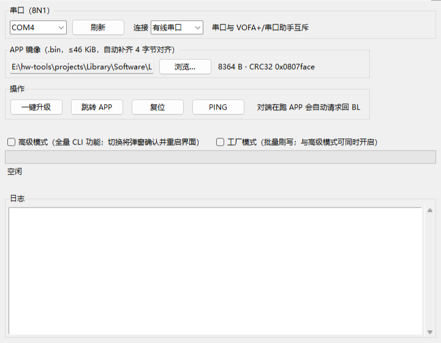
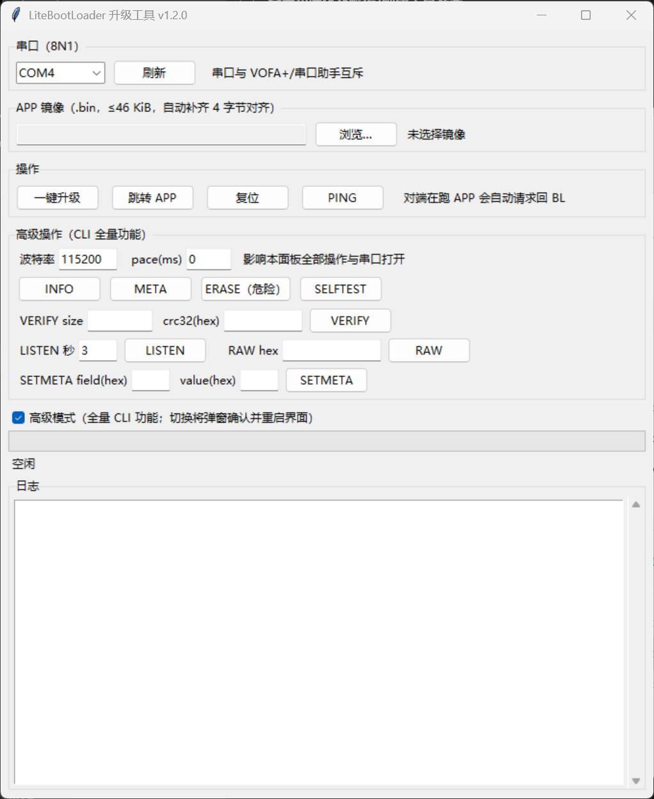

# LiteBootUpgrader — Host Tool for LiteBootLoader

[简体中文](README.md) | English

The official host tool for
[LiteBootLoader](https://github.com/Liu-bit264/LiteBootLoader) (the firmware repo,
sibling directory `../LiteBootLoader` locally): one-click upgrade over serial (wired)
or Bluetooth (HC-05 SPP), OTA status query, jump to APP, reset, workflow self-test and
a GUI.

Two entry points plus two helper scripts: `bl_upgrade.py` is both the CLI and the
protocol library (the **sole implementation** of the upgrade flow; frame format, command
table and state machine are specified in the firmware repo's `docs/protocol.md`), and
`bl_upgrade_gui.py` is the tkinter GUI (wired/Bluetooth connection, one-click
upgrade/jump/reset/PING); `bl_powerloss_drill.py` is the power-loss acceptance drill and
`test_host_protocol.py` the hardware-free host-side test suite. Pure Python, with pyserial
as the only runtime dependency (tkinter additionally for the GUI).

## Quick Start

### Option A: Prebuilt executables (no Python needed)

Double-click `dist\bl_upgrade_gui.exe` (build instructions below), or use
`dist\bl_upgrade.exe` on the command line. Single-file, no installation; distribution
is just copying the exe.

### Option B: Run from source (dependency isolation recommended)

> **Dependency isolation (recommended)**: install Python dependencies in an isolated
> environment (`uv run --with` or a venv) instead of polluting the global interpreter;
> wheels stay in the package manager cache. The examples below use `uv`; any Python
> with pyserial installed works too.

```bash
# GUI (or double-click bl_upgrade_gui.bat)
uv run --python 3.12 --with pyserial bl_upgrade_gui.py

# CLI
uv run --python 3.12 --with pyserial bl_upgrade.py upgrade <image.bin> --port COM4
uv run --python 3.12 --with pyserial bl_upgrade.py selftest --port COM4
```

## GUI Usage

**Basic mode** (default):



**Advanced mode** — tick the "advanced mode" checkbox at the bottom → confirm in the
dialog → the UI restarts with the full feature set; unticking likewise confirms and
restarts back. The mode is stored in `~/.litebootupgrader_gui.json`:



- **One-click upgrade**: works from any state (BL or APP) — when the target runs the
  APP, it automatically takes the "request back to BL" path (SET_META bl_request →
  reset → BL consumes the flag), with a progress bar and log throughout;
- **Connection type**: a dropdown in the serial frame selects "wired serial / Bluetooth
  HC-05" — Bluetooth is simply the SPP COM port created by pairing (the module needs a
  one-time AT setup to 115200, see the firmware repo's `docs/dev/bluetooth_notes.md`
  §5); open failures retry automatically; the protocol stack is fully shared with wired;
- **Jump / Reset / PING**: single-command actions, serial banner read back into the log pane;
- **Image pane**: shows the size and CRC32 after 4-byte padding (same scale as VERIFY);
- **Advanced panel (advanced mode only)**: INFO / META / OTA query / ERASE (double
  confirmation) / SELFTEST / VERIFY / LISTEN / RAW / SETMETA, plus baud-rate and
  pace(ms) options — behavior aligned one-to-one with the CLI;
- **Serial exclusivity**: close VOFA+ / other serial monitors first (a COM port is exclusive).

## CLI Subcommands

| Subcommand | Purpose |
|---|---|
| `upgrade <bin>` | One-click upgrade (ensure_bl → erase → chunked write → verify) |
| `ota` | OTA status query (BL/APP versions, APP validity, arrival channel, Bluetooth link) |
| `selftest` | 15-step hardware-in-the-loop upgrade self-test |
| `ping / info / meta` | Handshake / BL info & telemetry / parameter-area metadata |
| `erase / verify <size> <crc32_hex>` | Manual step-by-step operations |
| `jump / reset` | Jump to APP / reset |
| `setmeta <f> <v> / raw <hex> / listen <sec>` | Metadata / raw bytes / monitor |

Common options: `--port` (default COM4, set to your actual port; the Bluetooth SPP port
works the same way), `--baud 115200`, `--pace <ms>` (inter-command delay, for timing
experiments), `--conn serial|bt` (connection type; bt = Bluetooth SPP with automatic
open retry). Run `bl_upgrade.py -h` (`--help`) to list all subcommands and options;
`--version` prints the version.

### GUI vs CLI Capability Matrix

| Interface | Coverage |
|---|---|
| GUI basic mode (default) | One-click upgrade, jump to APP, reset, PING + serial enumeration/refresh, connection type (wired/Bluetooth), image CRC32 preview, progress bar/log pane |
| GUI advanced mode (tick, confirm, UI restart) | On top of basic mode: all 9 CLI debug/diagnostic operations (info / meta / ota / erase / verify / selftest / listen / raw / setmeta) plus baud-rate and pace options — **feature parity with the CLI** |
| CLI | All 13 subcommands + `-h/--help`, `--version`, `--conn` |

### Retry & Timeout (mirrors the firmware repo's docs/protocol.md §6)

The `upgrade` flow retries automatically: on a per-command response timeout (1 s for probes,
5 s for erase/verify, 2 s for write blocks) it resends, up to 3 attempts in total (1 initial
+ ≤2 resends) at 2.2 s intervals (≥ the BL's 2000 ms in-frame parser reset window); error
status codes are not retried (they are real answers). **Manual single commands are not
retried**; their timeouts are `ping/info/meta/setmeta` 1 s, `ota/jump/reset` 2 s,
`verify` 3 s, `erase` 8 s.

## Building Windows Executables

Double-click `build_exe.bat`, or run:

```bash
uv run --python 3.12 --with pyserial --with pyinstaller \
  pyinstaller --noconfirm --onefile --windowed --name bl_upgrade_gui bl_upgrade_gui.py
uv run --python 3.12 --with pyserial --with pyinstaller \
  pyinstaller --noconfirm --clean --onefile --console --name bl_upgrade bl_upgrade.py
```

Artifacts land in `dist\` (`build/` and `*.spec` are intermediates, not committed).

## Compatibility

| Item | Value |
|---|---|
| Scope | Works over the LiteBootLoader upgrade protocol (VER 0x01) and is **decoupled from the chip model**: any LiteBootLoader BL implementing this protocol is supported; validated combinations = BL 0.3.0 + STM32F103C8T6 (full flow) and the STM32F411CEU6 minimal package (info/upgrade/jump/setmeta round-trip); multi-chip parameterization follows the firmware repo's CSP roadmap |
| Protocol version | VER 0x01 (firmware repo `docs/protocol.md`; 0x10 OTA_QUERY available with BL 0.2.0+) |
| Companion firmware | LiteBootLoader BL 0.3.0+ (0.1.0/0.2.0 also work, without the `ota` query and the Bluetooth channel); **Bluetooth links require the firmware to enable the BT channel** (`BL_TRANSPORT_BT_EN=1`; not enabled in the default example config since 0.3.0 — see porting_guide §3.1) |
| Image limit | Currently validated against the STM32F103C8T6 partition, 46 KiB (0xB800), auto-padded to 4-byte alignment with 0xFF — the F411CEU6 (448K partition) upgrade/jump flow is verified but images remain subject to this 46K cap; `--chip` parameterization on the firmware repo's CSP roadmap |
| F411 known limits | On the F411CEU6 the `selftest` "out-of-range guard" step false-FAILs (the fixture hardcodes the F103 `APP_SIZE=0xB800`; that offset is a legal write inside the 448K APP region), and `bl_powerloss_drill.py` is unusable because its pyocd target name is hardcoded to F103 — both are fixed together with the `--chip` parameterization |
| Image verification | CRC-32/ISO-HDLC (zlib-compatible); frame check CRC16/MODBUS |
| Serial | 115200 8N1, Windows COMx / Linux ttyUSBx; Bluetooth = the SPP COM port created by pairing an HC-05 (one-time AT setup in the firmware repo's bluetooth_notes.md §5) |

## Troubleshooting

| Symptom | Fix |
|---|---|
| Opening the port fails (access denied) | Close the occupier: VOFA+ / serial monitor / another instance of this tool |
| Bluetooth port won't open / keeps dropping | Make sure the module is powered and paired (default PIN 1234); `--conn bt` / "Bluetooth HC-05" already retries on open, re-plug the module if it still fails |
| Bluetooth port never answers | The module's data-mode baud isn't 115200: redo the AT setup per the firmware repo's `docs/dev/bluetooth_notes.md` §5 |
| No COM port found | Confirm the debug adapter's CDC serial in Device Manager; try another USB cable/port (flaky contacts seen in practice) |
| All commands time out | The target may run the APP or sit halted under a debugger: reset it with the debugger and retry |
| Occasional timeout then success | USB-CDC jitter triggers the BL's 2 s in-frame timeout — normal (`upgrade` resends automatically; for a manual single command just run it again) |
| `verify failed: CRC_ERROR` | An interrupted upgrade left the image incomplete; run `upgrade` again (full erase + rewrite) |

## Version & License

Current version **v1.3.1**; history and change details in [CHANGELOG.md](CHANGELOG.md).

[MIT](LICENSE) © 2026 Qingc. LiteBootLoader is also MIT-licensed (its bundled
third_party/CMSIS retains its original license, see its LICENSES.md).

## Contributing

See [CONTRIBUTING.md](CONTRIBUTING.md) for the issue and PR workflow, the development
environment and the test / acceptance-drill commands.
